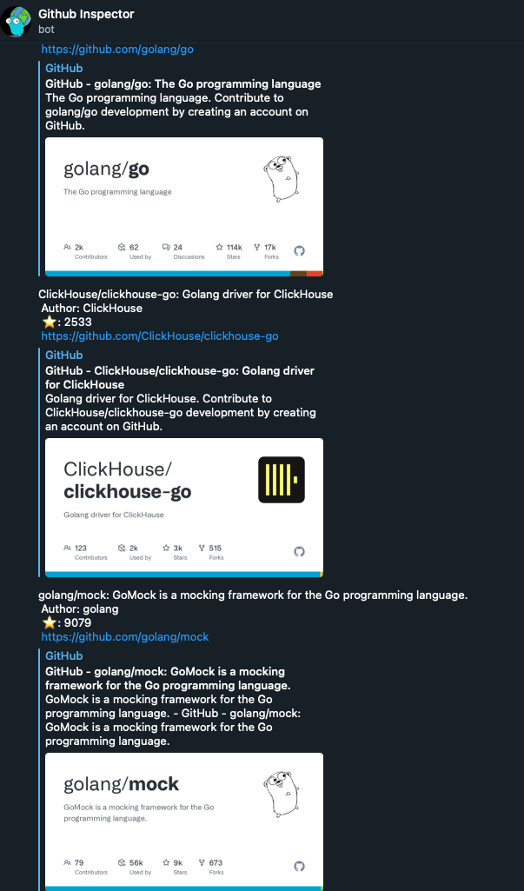
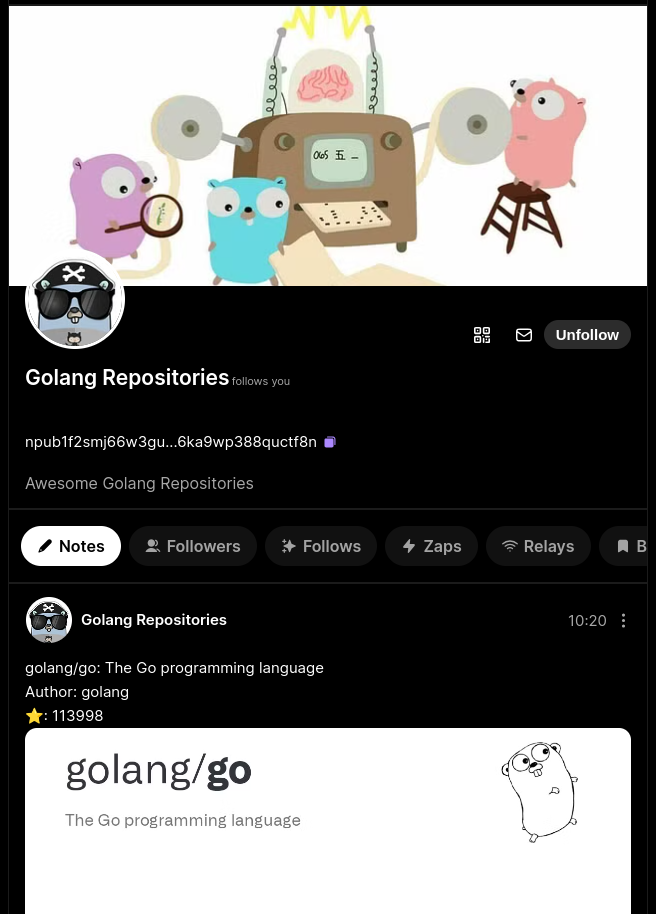

# Github inspector
Search and bring easily repos from github into different mediums, e.g: Telegram channels, Nostr

## Telegram

This project provides libraries to run a Telegram bot called [Github Inspector](https://t.me/GithubInspectorBot), which can answer with trending repositories on GitHub based on the language you provide as input.

## Nostr

This project also works as a Nostr bot called [Golang Repositories](https://snort.social/p/npub1f2smj66w3gu2apw3sgapxjwfxgeknp6ae9g8spy7nq6ka9wp388quctf8n) that publishes trending Golang repositories on Github. Basically, it makes web scraping on the [Github Trending page](https://github.com/trending). Please, follow the bot for more content. The content is published once a day, at 11 am CST (16 pm UTC).

